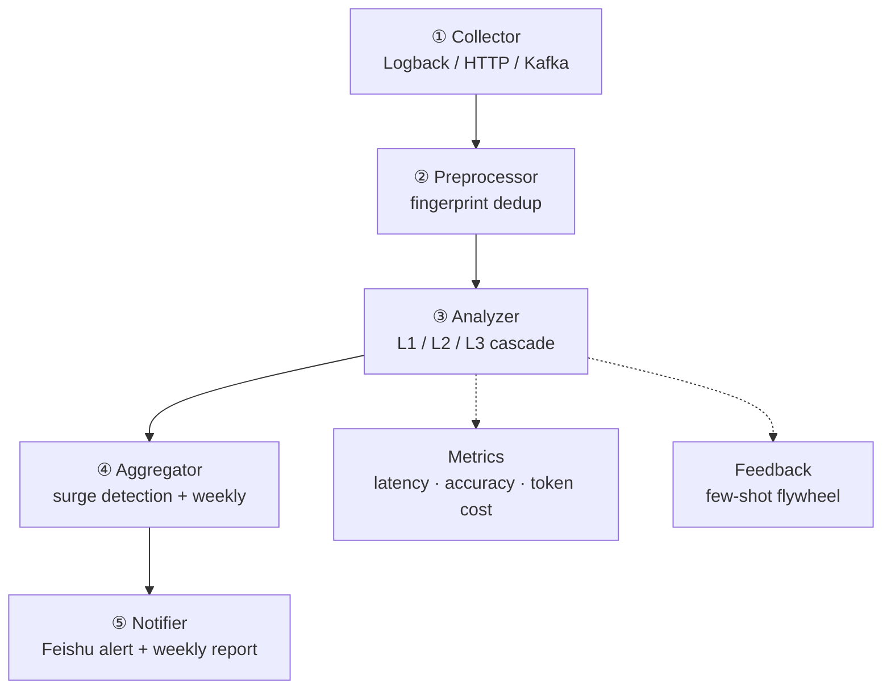

# StackWatch

**English** | [中文](README_zh.md)


> AI-driven root cause analysis for Java production errors — stacktrace fingerprint merging + LLM root cause localization + scheduled weekly digest.

StackWatch feeds production exception stack traces to an LLM for root cause localization and categorical merging, then aggregates high-frequency errors on a weekly schedule and pushes a Feishu weekly report.

**Goals:** cut mean time to localize production incidents by ~40%, and shorten the high-frequency-issue discovery window from days to hours.

## Table of Contents

- [Documentation](#documentation)
- [Architecture](#architecture)
  - [Three-tier merge (core)](#three-tier-merge-core)
- [Requirements](#requirements)
- [Quick Start](#quick-start)
- [Current Status](#current-status)
- [Tech Stack](#tech-stack)
- [Acknowledgments](#acknowledgments)
- [License](#license)

## Documentation

| Doc | Contents |
|-----|----------|
| 📐 [Detailed Design](docs/detailed-design.md) | Architecture, module design, core flows, data structures, schema, APIs, config |
| 🧭 [Tech Selection](docs/tech-selection.md) | Alternatives, comparison criteria, and rationale for each tech choice |
| 🚀 [Upgrade Path](docs/upgrade-path.md) | Current status, roadmap (V1.x → V3.x), prioritization advice |

## Architecture

A five-layer main pipeline plus two cross-cutting layers:



### Three-tier merge (core)

The Analyzer is the hub of the system. Most exceptions are resolved for free at L1/L2; only ~1% actually call the LLM.

| Tier | Mechanism | Token cost |
|------|-----------|------------|
| **L1** | Exact fingerprint cache hit | ≈ 0 |
| **L2** | Approximate vector merge | ≈ 0 |
| **L3** | LLM root cause on cluster representative | real LLM call (~1%) |

## Requirements

- **JDK 21+** — required by Spring Boot 4.1 + Spring AI 2.0 (Java 8/11/17 not supported)
- **Maven 3.6+**


## Quick Start

```bash
# 1. Configure the LLM API key (env var only — never hardcode)
export DASHSCOPE_API_KEY=sk-...

# 2. Build
mvn clean package

# 3. Run
mvn spring-boot:run

# 4. Try it — feed an exception stack trace and get an LLM root cause
curl -X POST http://localhost:8080/analyze \
  -H "Content-Type: application/json" \
  -d '{"appName":"order-service","exceptionType":"NullPointerException","exceptionMessage":"Cannot invoke method on null","stackTrace":["com.foo.OrderService.process(OrderService.java:42)","com.foo.OrderController.handle(OrderController.java:17)"]}'
```

## Current Status

MVP — the core analysis pipeline works; several modules are pending integration.

| Layer | Status |
|-------|--------|
| Domain data structures (immutable records) | ✅ Done |
| ② Preprocessor — fingerprint generation (SHA-256 + framework-frame filtering + versioning) | ✅ Done |
| ③ Analyzer — L1 cache (Caffeine) + L3 LLM root cause (structured output + Function Calling) | ✅ Done |
| L2 vector merge — interface defined, pending PgVector integration | 🚧 Pending |
| ① Collector — pending Kafka / Logback Appender integration | 🚧 Pending |
| ④ ⑤ Aggregator / Notifier — pending Feishu weekly report | 🚧 Pending |
| Cross-cutting A/B — pending Micrometer + feedback loop | 🚧 Pending |

## Tech Stack

| Area | Choice |
|------|--------|
| Framework | Spring Boot 4.1 + Java 21 |
| LLM | Spring AI 2.0 (OpenAI-compatible; DashScope/DeepSeek switchable) |
| L1 cache | Caffeine |
| L2 vectors | PgVector (pending integration) |

## Acknowledgments

Design inspiration from:

- **PostHog** error_tracking — fingerprint algorithm versioning, embedding rendering metadata, weekly report structure
- **Arvo-AI/aurora** — post-RCA action automation, knowledge-base accumulation
- **salesforce/PyRCA** — RCA evaluation methodology

## License

Released under the [MIT License](https://opensource.org/licenses/MIT).
