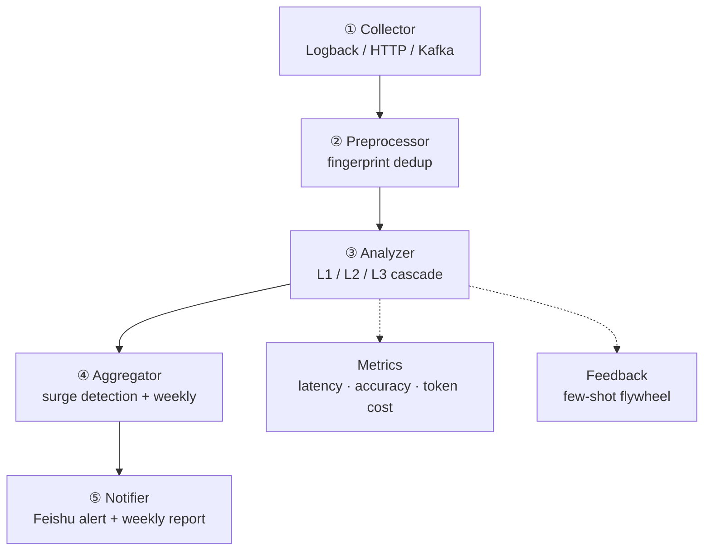

# StackWatch

**English** | [中文](README_zh.md)


> AI-driven root cause analysis for Java production errors — stacktrace fingerprint merging + LLM root cause localization + scheduled weekly digest.

StackWatch feeds production exception stack traces to an LLM for root cause localization and categorical merging, then aggregates high-frequency errors on a weekly schedule and pushes a Feishu weekly report.

**Goals:** cut mean time to localize production incidents by ~40%, and shorten the high-frequency-issue discovery window from days to hours.

## Table of Contents

- [Documentation](#documentation)
- [Architecture](#architecture)
  - [Three-tier merge (core)](#three-tier-merge-core)
- [Requirements](#requirements)
- [Quick Start](#quick-start)
- [Current Status](#current-status)
- [Recent Highlights](#recent-highlights)
- [Tech Stack](#tech-stack)
- [Acknowledgments](#acknowledgments)
- [License](#license)

## Documentation

| Doc | Contents |
|-----|----------|
| 📐 [Detailed Design](docs/detailed-design.md) | Architecture, module design, core flows, data structures, schema, APIs, config |
| 🧭 [Tech Selection](docs/tech-selection.md) | Alternatives, comparison criteria, and rationale for each tech choice |
| 🚀 [Upgrade Path](docs/upgrade-path.md) | Current status, roadmap (V1.x → V3.x), prioritization advice |

## Architecture

A five-layer main pipeline plus two cross-cutting layers:



### Three-tier merge (core)

The Analyzer is the hub of the system. Most exceptions are resolved for free at L1/L2; only ~1% actually call the LLM.

| Tier | Mechanism | Token cost |
|------|-----------|------------|
| **L1** | Exact fingerprint cache hit | ≈ 0 |
| **L2** | Approximate vector merge | ≈ 0 |
| **L3** | LLM root cause on cluster representative | real LLM call (~1%) |

### Review level & feedback flywheel

Beyond the cost ladder, the L3 path applies a **three-tier review gate** (inspired by PagePilot's confidence gating):

| Confidence / signal | Review level | Action |
|---------------------|--------------|--------|
| >= high threshold (0.9) + evidence | `AUTO_CONFIRMED` | auto-attest, no human |
| between fallback (0.6) and high + evidence | `NEEDS_CONFIRMATION` | output root cause, flag for low-touch confirmation |
| < fallback / no evidence / LLM failure | `NEEDS_HUMAN_REVIEW` | escalate to human |

The feedback layer is a **bidirectional flywheel**: a developer confirms or corrects a root cause via `POST /feedback` -> a positive sample (few-shot, "answer this way") and, when `wrongRootCause` is present, a negative sample (anti-pattern, "don't answer that way"). Both are injected into the next L3 prompt--positive guides, negative warns. This is PagePilot's `known-failures` idea applied to the negative side, pairing with the few-shot positive side for a complete self-learning loop.

### Context optimization & semantic caching

Two defenses sit in front of the LLM to keep prompts lean and the token bill down:

- **Semantic caching (L2)**. L2 is a semantic cache, not just an approximate merge: a new error whose embedding is ≥ 0.92 similar to an existing cluster returns that cluster's root cause with zero LLM call. On hit, the result is **back-filled into L1**, so subsequent identical fingerprints resolve at L1 -- the cache gradient is self-reinforcing. This is the ideal scenario for RCA, where one root cause surfaces as many stack-trace instances with different literals.
- **Context optimization**. `ContextOptimizer` truncates the prompt vars (`exceptionMessage`, `mdc`) and every `@Tool` return value before they reach the LLM. Production exception messages can carry full SQL / response bodies, and `queryTraceContext` against SkyWalking/ARMS can return tens of thousands of characters per trace -- without this gate the context window blows up and hallucination risk rises. Thresholds are configurable via `stackwatch.context-optimizer.*`.

## Requirements

- **JDK 21+** — required by Spring Boot 4.1 + Spring AI 2.0 (Java 8/11/17 not supported)
- **Maven 3.6+**


## Quick Start

```bash
# 1. Configure the LLM API key (env var only — never hardcode)
export DASHSCOPE_API_KEY=sk-...

# 2. Build
mvn clean package

# 3. Run
mvn spring-boot:run

# 4. Try it — feed an exception stack trace and get an LLM root cause
curl -X POST http://localhost:8080/analyze \
  -H "Content-Type: application/json" \
  -d '{"appName":"order-service","exceptionType":"NullPointerException","exceptionMessage":"Cannot invoke method on null","stackTrace":["com.foo.OrderService.process(OrderService.java:42)","com.foo.OrderController.handle(OrderController.java:17)"]}'
```

## Current Status
MVP - the full five-layer pipeline + two cross-cutting layers are implemented; L2 / Kafka are off by default and unlock via config.

| Layer | Status |
|-------|--------|
| Domain data structures (immutable records) | ✅ Done |
| ② Preprocessor - fingerprint generation (SHA-256 + framework-frame filtering + versioning) | ✅ Done |
| ③ Analyzer - L1 cache + L2 vector merge + L3 LLM root cause (structured output + Function Calling) | ✅ Done |
| Context optimization - ContextOptimizer (truncate prompt vars & @Tool returns) | ✅ Done |
| ① Collector - Logback Appender + HTTP + Kafka (off by default, progressive unlock) | ✅ Done |
| ④ ⑤ Aggregator / Notifier - real-time surge detection + Feishu weekly report | ✅ Done |
| Cross-cutting A/B - Micrometer metrics + bidirectional feedback flywheel (few-shot + anti-pattern) | ✅ Done |

## Recent Highlights

- **Context optimization layer** (`ContextOptimizer`) - truncates prompt vars (`exceptionMessage` / `mdc`) and `@Tool` returns before the LLM, preventing context-window blow-up once real data sources (SkyWalking/ARMS) are wired in.
- **Semantic caching** - L2 returns a historical root cause on embedding similarity ≥ 0.92 with zero tokens, and back-fills L1 on hit.
- **Three-tier review gate** (`AUTO_CONFIRMED` / `NEEDS_CONFIRMATION` / `NEEDS_HUMAN_REVIEW`) - confidence + evidence gating, inspired by PagePilot.
- **Bidirectional feedback flywheel** - few-shot positive samples + anti-pattern negative samples ("answer this way" / "don't answer that way"), both injected into the next L3 prompt.
- **Stack upgrade** - JDK 21 + Spring Boot 4.1 + Spring AI 2.0.

## Tech Stack

| Area | Choice |
|------|--------|
| Framework | Spring Boot 4.1 + Java 21 |
| LLM | Spring AI 2.0 (OpenAI-compatible; DashScope/DeepSeek switchable) |
| L1 cache | Caffeine (Redis for production) |
| L2 vectors | PgVector (off by default, progressive unlock) |
| Messaging | Kafka (collector's third entry, off by default) |
| Resilience | Resilience4j |
| Metrics | Micrometer + Prometheus |

## Acknowledgments

Design inspiration from:

- **PostHog** error_tracking — fingerprint algorithm versioning, embedding rendering metadata, weekly report structure
- **Arvo-AI/aurora** — post-RCA action automation, knowledge-base accumulation
- **salesforce/PyRCA** — RCA evaluation methodology
- **PagePilot** (Alipay merchant-center testing team) – confidence-tiered review gating (auto / needs-confirmation / needs-human-review) and the known-failures self-learning library; adapted here as the three-tier review level on L3 plus the positive/negative bidirectional feedback flywheel (few-shot + anti-pattern)

## License

Released under the [MIT License](https://opensource.org/licenses/MIT).
