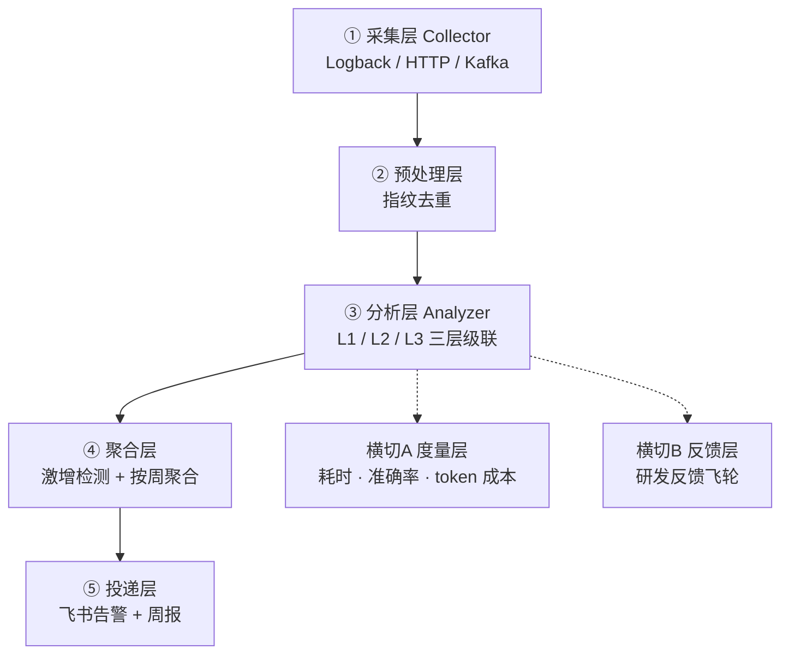

# StackWatch

[English](README.md) | **中文**


> AI 驱动的 Java 生产错误根因分析 - 异常堆栈指纹归并 + LLM 根因定位 + 定时周报聚合。

将生产异常堆栈自动投喂 LLM 进行根因定位与分类归并，结合定时任务按周聚合高频错误并推送飞书周报。

**目标：** 生产故障平均定位耗时缩短约 40%，高频问题发现周期由天级缩短至小时级。

## 目录

- [文档](#文档)
- [架构总览](#架构总览)
  - [分析层三层归并（核心）](#分析层三层归并核心)
- [环境要求](#环境要求)
- [快速开始](#快速开始)
- [当前状态](#当前状态)
- [技术栈](#技术栈)
- [开源致谢](#开源致谢)
- [许可证](#许可证)

## 文档

| 文档 | 内容 |
|------|------|
| 📐 [详细设计](docs/detailed-design.md) | 架构详设、模块设计、核心流程、数据结构、表结构、接口、配置 |
| 🧭 [选型分析](docs/tech-selection.md) | 每个技术选型的备选方案、对比维度、决策与理由 |
| 🚀 [升级路径](docs/upgrade-path.md) | 当前状态、后续演进路线（V1.x -> V3.x）、优先级建议 |

## 架构总览

五层主链路 + 两层横切：



### 分析层三层归并（核心）

分析层是系统中枢。绝大多数异常在 L1/L2 免费归并，仅约 1% 真正调用 LLM。

| 层级 | 机制 | token 成本 |
|------|------|------------|
| **L1** | 指纹精确命中缓存 | ≈ 0 |
| **L2** | 向量近似归并 | ≈ 0 |
| **L3** | LLM 簇代表根因分析 | 真正调 LLM（约 1%） |

## 环境要求

- **JDK 21+** - Spring Boot 4.1 + Spring AI 2.0 强制要求（不支持 Java 8/11/17）
- **Maven 3.6+**

## 快速开始

```bash
# 1. 配置 LLM API Key（走环境变量，禁止写入代码）
export DASHSCOPE_API_KEY=sk-...

# 2. 构建
mvn clean package

# 3. 运行
mvn spring-boot:run

# 4. 试用：输入异常堆栈，获取 LLM 根因
curl -X POST http://localhost:8080/analyze \
  -H "Content-Type: application/json" \
  -d '{"appName":"order-service","exceptionType":"NullPointerException","exceptionMessage":"Cannot invoke method on null","stackTrace":["com.foo.OrderService.process(OrderService.java:42)","com.foo.OrderController.handle(OrderController.java:17)"]}'
```

## 当前状态

MVP 阶段 - 核心分析链路已通，部分模块待接入。

| 层 | 状态 |
|----|------|
| domain 数据结构（不可变 record） | ✅ 已完成 |
| ② 预处理层 - 指纹生成（SHA-256 + 框架帧过滤 + 版本化） | ✅ 已完成 |
| ③ 分析层 - L1 缓存（Caffeine）+ L3 LLM 根因（结构化输出 + Function Calling） | ✅ 已完成 |
| L2 向量归并 - 接口已定义，待接入 PgVector | 🚧 待接入 |
| ① 采集层 - 待接入 Kafka / Logback Appender | 🚧 待接入 |
| ④ ⑤ 聚合层 / 投递层 - 待实现飞书周报 | 🚧 待接入 |
| 横切 A/B - 待接入 Micrometer + 反馈闭环 | 🚧 待接入 |

## 技术栈

| 领域 | 选型 |
|------|------|
| 框架 | Spring Boot 4.1 + Java 21 |
| LLM | Spring AI 2.0（OpenAI 兼容协议，DashScope/DeepSeek 可切换） |
| L1 缓存 | Caffeine |
| L2 向量 | PgVector（待接入） |

## 开源致谢

本项目借鉴了以下优秀开源项目的设计思想：

- **PostHog** error_tracking：指纹算法版本化、embedding rendering 元数据、周报结构
- **Arvo-AI/aurora**：RCA 后动作自动化、知识库积累思想
- **salesforce/PyRCA**：RCA 评估方法论

## 许可证

基于 [MIT License](https://opensource.org/licenses/MIT) 发布。
