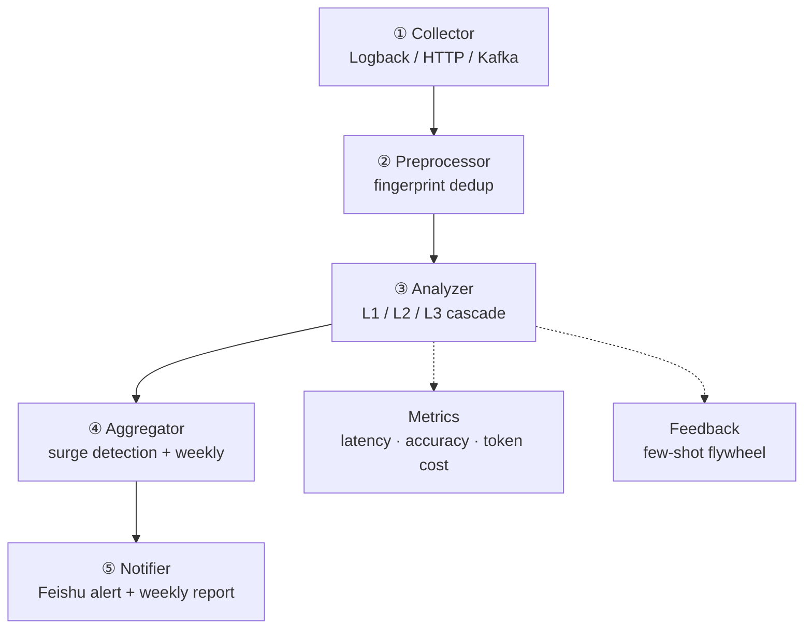

# Architecture

## Five-layer pipeline + two cross-cutting layers

Data flow: `ErrorEventCollector` (collect) -> `Fingerprinter.generate` (preprocess) -> `ErrorAnalyzer.analyze` (L1->L2->L3) -> cluster lands in `ClusterRepository` -> `WeeklyAggregator`/`HighFrequencyDetector` (aggregate) -> `FeishuClient` (deliver).

## Three-tier cascade merge (core)

The Analyzer is the hub of the system. Most exceptions are resolved for free at L1/L2; only ~1% actually call the LLM.

| Tier | Mechanism | Token cost |
|------|-----------|------------|
| **L1** | Exact fingerprint cache hit (Caffeine) | ~0 |
| **L2** | Approximate vector merge (PgVector) | ~0 |
| **L3** | LLM root cause on cluster representative | real LLM call (~1%) |

### L1 - Fingerprint cache

`FingerprintCache` (Caffeine): exact fingerprint-hash hit -> reuse historical `RootCauseAnalysis`, 0 tokens.

### L2 - Vector merge

`ClusterRepository.findSimilar`: vector similarity merges into an existing cluster, 0 tokens. Skipped when `embedding == null` (L2 off). L2 is also a **semantic cache**: a new error whose embedding is >= 0.92 similar returns that cluster's root cause with zero LLM call. On hit, the result is **back-filled into L1**, so subsequent identical fingerprints resolve at L1.

### L3 - LLM root cause

`callLlm`: new cluster calls ChatClient, `.entity(RootCauseAnalysis.class)` for structured output + `.tools(analysisTools)` injects `@Tool` functions to prevent hallucination. `postProcess` applies confidence fallback (confidence < threshold **or** evidence empty -> `needHumanReview=true`; LLM exception -> fallback UNKNOWN root cause).

## Review level and feedback flywheel

| Confidence / signal | Review level | Action |
|---------------------|--------------|--------|
| >= high threshold (0.9) + evidence | `AUTO_CONFIRMED` | auto-attest, no human |
| between fallback (0.6) and high + evidence | `NEEDS_CONFIRMATION` | output root cause, flag for low-touch confirmation |
| < fallback / no evidence / LLM failure | `NEEDS_HUMAN_REVIEW` | escalate to human |

The feedback layer is a **bidirectional flywheel**: a developer confirms or corrects a root cause via `POST /feedback` -> a positive sample (few-shot) and, when `wrongRootCause` is present, a negative sample (anti-pattern). Both are injected into the next L3 prompt.

## Zero-infrastructure startup

The project starts with **no DB / no Kafka / no vector store** by default, controlled by:

1. `spring.autoconfigure.exclude` list in `application.yml`
2. Each repository/channel selects its implementation via `@ConditionalOnProperty`

`ClusterRepository` has two mutually exclusive implementations selected by `stackwatch.l2.enabled`: `InMemoryClusterRepository` (default, `findSimilar` always returns empty, forcing L3) vs `PgVectorClusterRepository`.

## Context optimization

`ContextOptimizer` truncates the prompt vars (`exceptionMessage`, `mdc`) and every `@Tool` return value before they reach the LLM. Production exception messages can carry full SQL / response bodies. Thresholds are configurable via `stackwatch.context-optimizer.*`.
