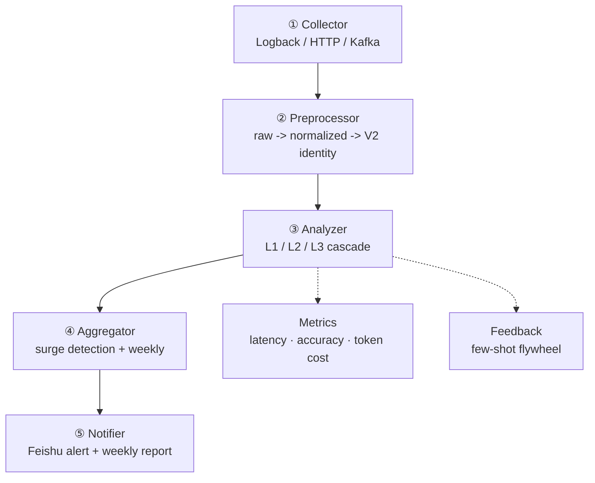

# Architecture

## Five-layer pipeline + two cross-cutting layers

```mermaid
flowchart TD
    C[① Collector<br/>Logback / HTTP / Kafka] --> P[② Preprocessor<br/>raw -> normalized -> V2 identity]
    P --> A[③ Analyzer<br/>L1 / L2 / L3 cascade]
    A --> G[④ Aggregator<br/>surge detection + weekly]
    G --> N[⑤ Notifier<br/>Feishu alert + weekly report]
    A -.-> M[Metrics<br/>latency · accuracy · token cost]
    A -.-> F[Feedback<br/>few-shot flywheel]
```

Data flow: `ErrorEventCollector` (raw collect) -> `ErrorNormalizer` (effective cause, message, and
frame normalization) -> `Fingerprinter.generateV2` (strict/loose V2 identities) ->
`ErrorAnalyzer.analyze` (exact history/L1 -> L2 -> L3) -> cluster lands in `ClusterRepository` ->
`WeeklyAggregator`/`HighFrequencyDetector` (aggregate) -> `FeishuClient` (deliver).

## Raw ingress and normalized V2 identity

Collectors retain an immutable `ThrowableInfo` primary-cause chain with raw type, message, frames,
and direct cause. They do not classify frames or rewrite messages. `ErrorNormalizer` subsequently
selects the deepest typed non-wrapper cause (up to the safe cause-chain limit), chooses effective
application frames before outer/raw fallbacks, and masks volatile UUID/IP/date/time/hash/ID/query
values while preserving configured application error codes and semantic status tokens.

V2 renders two SHA-256 values from the normalized application, effective exception type, message
template, and selected frames:

- `strictFingerprint` includes the normalized message and is the authoritative exact identity.
- `looseFingerprint` omits the message and is non-authoritative; it cannot return an old RCA,
  merge counts, or bypass L2/L3.

The exact key is `(appName, FingerprintVersion, strictFingerprint)`, which keeps applications and
V1/V2 algorithm versions isolated. Configure frame classification with
`stackwatch.fingerprint.application-packages` (an allowlist when non-empty), plus
`wrapper-exception-types` and `application-error-codes`. With no package allowlist, the existing
framework-prefix denylist is used.

## Deep Path (opt-in)

When `stackwatch.incident.enabled=true`, qualifying Fast Path results are handed to a separate
asynchronous runtime. PostgreSQL stores Incident lifecycle, triggers, decisions, Observations,
Evidence, hypotheses, and report snapshots. Compare-and-set claiming ensures one worker per active
identity; step count, Toolset calls, per-call timeout, and total timeout are hard limits.

The runtime selects versioned JVM Skills deterministically, then calls only server-registered,
read-only Logs, Trace, and Git/Deployment adapters with the Incident's application/environment/
cluster scope. No URL, credential, shell, SQL, Kubernetes command, or remediation selector is
accepted from an API caller or model. Summaries are redacted and content-hashed before persistence.
Only SUCCESS Observations may become Evidence; one independent source is PROVISIONAL, two are
VERIFIED, and zero requires human review.

Manual APIs are `POST /incidents` (existing `clusterId`, optional note), `GET /incidents/{id}`, and
`GET /incidents/{id}/report`. Stub Adapters and the Feign-timeout fixture are deterministic test
seams, not production integrations. Deep Path has no remediation or recovery semantics.

## Three-tier cascade merge (core)

The Analyzer is the hub of the system. Most exceptions are resolved for free at L1/L2; only ~1% actually call the LLM.

| Tier | Mechanism | Token cost |
|------|-----------|------------|
| **L1** | Exact fingerprint cache hit (Caffeine) | ~0 |
| **L2** | Approximate vector merge (PgVector) | ~0 |
| **L3** | LLM root cause on cluster representative | real LLM call (~1%) |

### L1 - Fingerprint cache

`FingerprintCache` (Caffeine): exact composite-key hit -> reuse the stored group/RCA, 0 tokens.
The cache accelerates lookup but does not bypass durable occurrence recording.

### L2 - Vector merge

`ClusterRepository.findSimilar`: vector similarity merges into an existing cluster, 0 tokens. Skipped when `embedding == null` (L2 off). L2 is also a **semantic cache**: a new error whose embedding is >= 0.92 similar returns that cluster's root cause with zero LLM call. On hit, the result is **back-filled into L1**, so subsequent identical fingerprints resolve at L1.

### L3 - LLM root cause

`callLlm`: new cluster calls ChatClient, `.entity(RootCauseAnalysis.class)` for structured output + `.tools(analysisTools)` injects `@Tool` functions to prevent hallucination. `postProcess` applies confidence fallback (confidence < threshold **or** evidence empty -> `needHumanReview=true`; LLM exception -> fallback UNKNOWN root cause).

## Review level and feedback flywheel

| Confidence / signal | Review level | Action |
|---------------------|--------------|--------|
| >= high threshold (0.9) + evidence | `AUTO_CONFIRMED` | auto-attest, no human |
| between fallback (0.6) and high + evidence | `NEEDS_CONFIRMATION` | output root cause, flag for low-touch confirmation |
| < fallback / no evidence / LLM failure | `NEEDS_HUMAN_REVIEW` | escalate to human |

The feedback layer is a **bidirectional flywheel**: a developer confirms or corrects a root cause via `POST /feedback` -> a positive sample (few-shot) and, when `wrongRootCause` is present, a negative sample (anti-pattern). Both are injected into the next L3 prompt.

## Zero-infrastructure startup

The project starts with **no DB / no Kafka / no vector store** by default, controlled by:

1. `spring.autoconfigure.exclude` list in `application.yml`
2. Each repository/channel selects its implementation via `@ConditionalOnProperty`

`ClusterRepository` has two mutually exclusive implementations selected by `stackwatch.l2.enabled`: `InMemoryClusterRepository` (default, `findSimilar` always returns empty, forcing L3) vs `PgVectorClusterRepository`.

## Durable exact error-group history (opt-in)

Set `stackwatch.error-history.enabled=true` and configure its nested
`stackwatch.error-history.datasource.url`, `.username`, and `.password` properties to enable the
PostgreSQL migration and repository. This datasource is independent from the Incident datasource
and from L2; when the flag is absent or false, no history datasource or migration is created.

New exact groups are V2-primary. The analyzer checks V2 first, then performs a V1 read-only
compatibility lookup; it never silently migrates V1 data. A non-blank stable
`ErrorEvent.Context.Identity.eventId` is required for retry-safe occurrence counting. Missing or
blank IDs count every submission. The built-in HTTP endpoints generate a new UUID for each request,
so they should not be treated as retry-idempotent unless an upstream integration preserves the
event identity. History lookup/recording failures are logged and instrumented, then the analyzer
continues through the non-durable L2/L3 fallback.

The current change intentionally does not retain every raw occurrence, make L2 restart-safe, or
retire V1. Those items are deferred to GitHub #6.

## Context optimization

`ContextOptimizer` truncates the prompt vars (`exceptionMessage`, `mdc`) and every `@Tool` return value before they reach the LLM. Production exception messages can carry full SQL / response bodies. Thresholds are configurable via `stackwatch.context-optimizer.*`.
