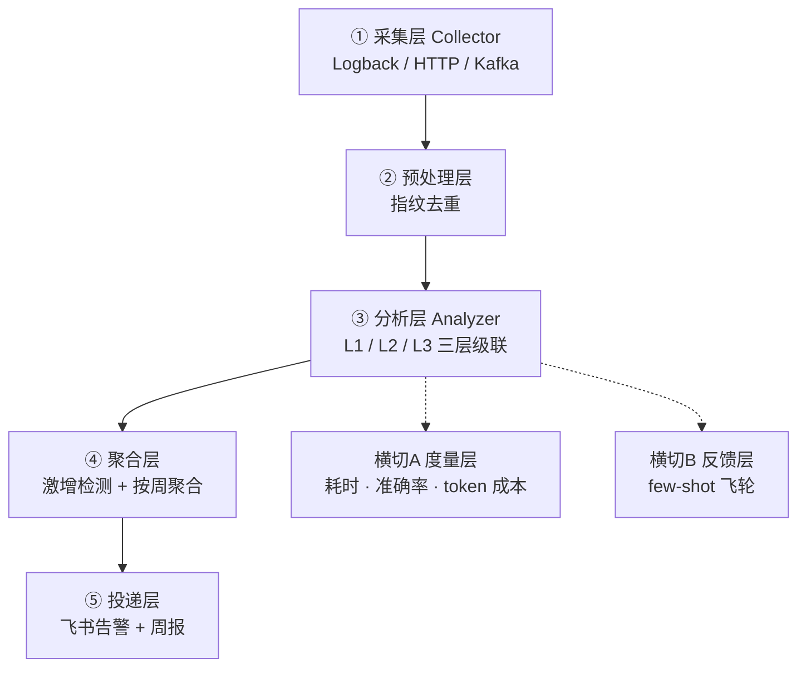

# 架构设计

## 五层主链路 + 两横切

数据流：`ErrorEventCollector`（采集）-> `Fingerprinter.generate`（预处理）-> `ErrorAnalyzer.analyze`（L1->L2->L3）-> 簇落入 `ClusterRepository` -> `WeeklyAggregator`/`HighFrequencyDetector`（聚合）-> `FeishuClient`（投递）。

## 三层级联归并（核心）

分析层是系统中枢。绝大多数异常在 L1/L2 免费归并，仅约 1% 真正调用 LLM。

| 层级 | 机制 | token 成本 |
|------|------|------------|
| **L1** | 指纹精确命中缓存（Caffeine） | ~0 |
| **L2** | 向量近似归并（PgVector） | ~0 |
| **L3** | LLM 簇代表根因分析 | 真正调 LLM（约 1%） |

### L1 - 指纹缓存

`FingerprintCache`（Caffeine）：指纹 hash 精确命中 -> 复用历史 `RootCauseAnalysis`，0 token。

### L2 - 向量归并

`ClusterRepository.findSimilar`：向量相似度归入已有簇，0 token。`embedding == null` 时跳过（L2 关闭）。L2 本质是**语义缓存**：新错误 embedding 与已有簇相似度 >= 0.92 时，零 LLM 调用返回该簇根因。命中后结果**反向填充 L1**，后续相同指纹在 L1 直接命中。

### L3 - LLM 根因

`callLlm`：新簇调用 ChatClient，`.entity(RootCauseAnalysis.class)` 结构化输出 + `.tools(analysisTools)` 注入 `@Tool` 防幻觉。`postProcess` 置信度兜底（置信度 < 阈值 **或** 证据为空 -> `needHumanReview=true`；LLM 异常 -> 兜底 UNKNOWN）。

## 复核级别与反馈飞轮

| 置信度 / 信号 | 复核级别 | 动作 |
|--------------|---------|------|
| >= 高阈值（0.9）且有证据 | `AUTO_CONFIRMED` | 自动归因，不打扰研发 |
| 兜底阈值（0.6）与高阈值之间且有证据 | `NEEDS_CONFIRMATION` | 输出根因，标记待确认 |
| < 兜底阈值 / 无证据 / LLM 失败 | `NEEDS_HUMAN_REVIEW` | 转人工排查 |

反馈层是**正负双向飞轮**：研发通过 `POST /feedback` 确认或纠正根因 -> 正样本（few-shot）+ 当携带 `wrongRootCause` 时负样本（anti-pattern）。两者均注入下一次 L3 prompt。

## 零基础设施启动

项目默认**无 DB、无 Kafka、无向量库**启动，由两套机制控制：

1. `application.yml` 的 `spring.autoconfigure.exclude` 列表
2. 每个 Repository/Channel 通过 `@ConditionalOnProperty` 选择实现

`ClusterRepository` 有两个互斥实现，由 `stackwatch.l2.enabled` 选择：`InMemoryClusterRepository`（默认，`findSimilar` 始终返回空，强制走 L3）vs `PgVectorClusterRepository`。

## 上下文优化

`ContextOptimizer` 在 Prompt 入参（`exceptionMessage`、`mdc`）与每个 `@Tool` 返回值进入 LLM 前做截断。阈值走 `stackwatch.context-optimizer.*` 配置。
